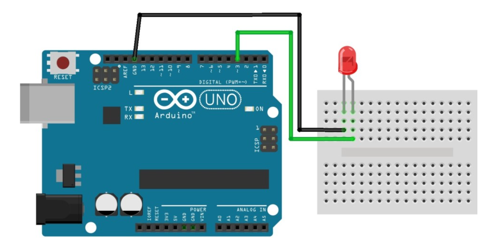
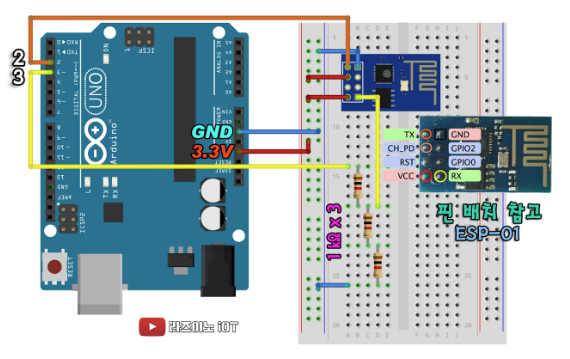

### LED

##### Code

```c++
void setup() {
  // put your setup code here, to run once:
  pinMode(3, OUTPUT);
}

void loop() {
  // put your main code here, to run repeatedly:
  digitalWrite(3, HIGH);
  delay(1000);
  digitalWrite(3, LOW);
  delay(1000);
}
```

##### 회로도



##### 연결사진


### WIFI(ESP8266 모듈 사용)

##### Code

```c++
#include <SoftwareSerial.h>
#define BT_RXD 2
#define BT_TXD 3
SoftwareSerial ESP_wifi(BT_RXD, BT_TXD);
void setup() {
  Serial.begin(9600);
  ESP_wifi.begin(9600);
  ESP_wifi.setTimeout(5000);
  delay(1000);
}
void loop() {
  if (Serial.available()){
    ESP_wifi.write(Serial.read());
  }
  if (ESP_wifi.available()){
    Serial.write(ESP_wifi.read());
  }
}
```

##### 회로도



##### 연결 사진


###### 참고사항

```
- WIFI 모듈의 펌웨어가 상이해
- 링크를 참고해 펌웨어 업그레이드(https://rasino.tistory.com/297#google_vignette)
- 아두이노 스케치를 blink 예제를 넣은 후 아두이노를 재부팅 한 후 업그레이드 실행함
```

###### 자동 wifi 연결 코드 (wifi, pw 입력)

```c++
#include <SoftwareSerial.h>
#define BT_RXD 2
#define BT_TXD 3

SoftwareSerial ESP_wifi(BT_RXD, BT_TXD);

//WIFI ID
String SSID="JYP";
//WIFI PW
String PASSWORD="wldb1246400";

void connectWifi(){

  Serial.begin(9600);
  ESP_wifi.begin(9600);
  ESP_wifi.setTimeout(5000);
  delay(1000);
  String cmd = "AT+CWMODE=1";
  ESP_wifi.println(cmd);
  cmd ="AT+CWJAP=\""+SSID+"\",\""+PASSWORD+"\"";
  ESP_wifi.println(cmd);
}


void setup() {
  connectWifi();
}

void loop() {
  if (Serial.available()){
    ESP_wifi.write(Serial.read());
  }
  if (ESP_wifi.available()){
    Serial.write(ESP_wifi.read());
  }
}
```

### 웹소켓

##### Code

```c++

```