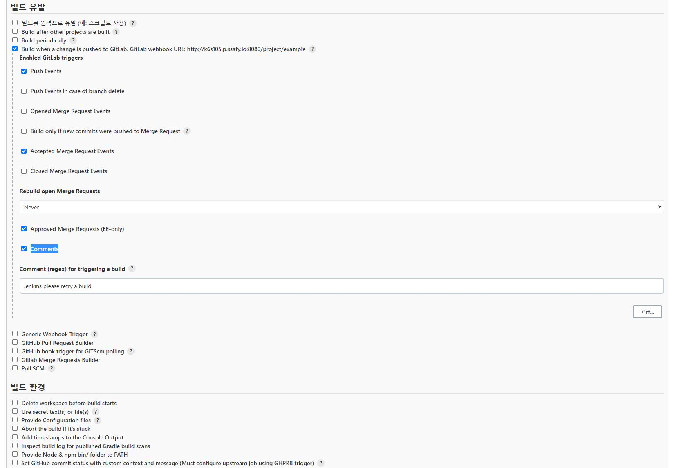

소스 코드 관리 

Git 

**Repository URL**

https://lab.ssafy.com/s06-final/S06P31S105.git

**Credentials**

**Username**에 gitlab 계정아이디(필수 값)

**Password**에 gitlba 계정비밀번호(필수 값)

**ID**에는 Credential을 식별하는 아이디(필수 값)

Description은 이 Credential에 대한 설명을 입력하자.

Gitlab Project에서 Settings -> '빌드 유발' 탭에서, 'Buil when a change...' 에 표시되는 url을 복사 해둔다. URL : http://k6s105.p.ssafy.io:8080/project/example

Secret token 

고급을 눌러서 Generate해서 생성

Trigger에 Push evenets 체크 **Enable SSL verification** 체크

빌드 유발에서 Build when a change is pushed to GitLab. GitLab webhook URL: http://k6s105.p.ssafy.io:8080/project/example[?](http://k6s105.p.ssafy.io:8080/job/example/configure#)

Enabled GitLab triggers 체크

Push Events

Accepted Merge Request Events

Approved Merge Requests (EE-only)

Comments

체크

저장

