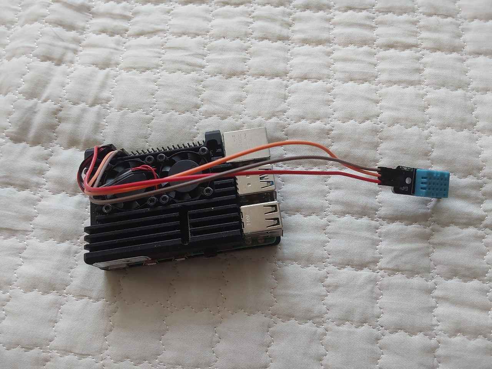
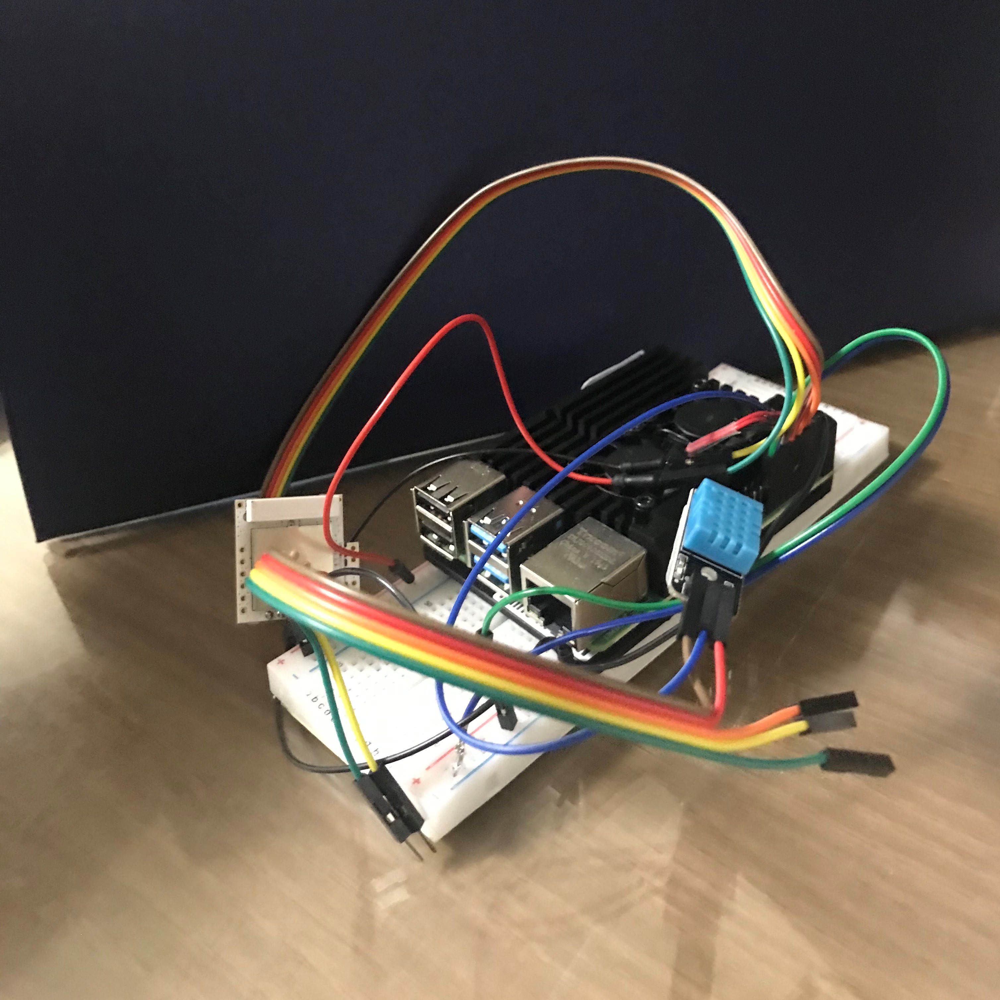
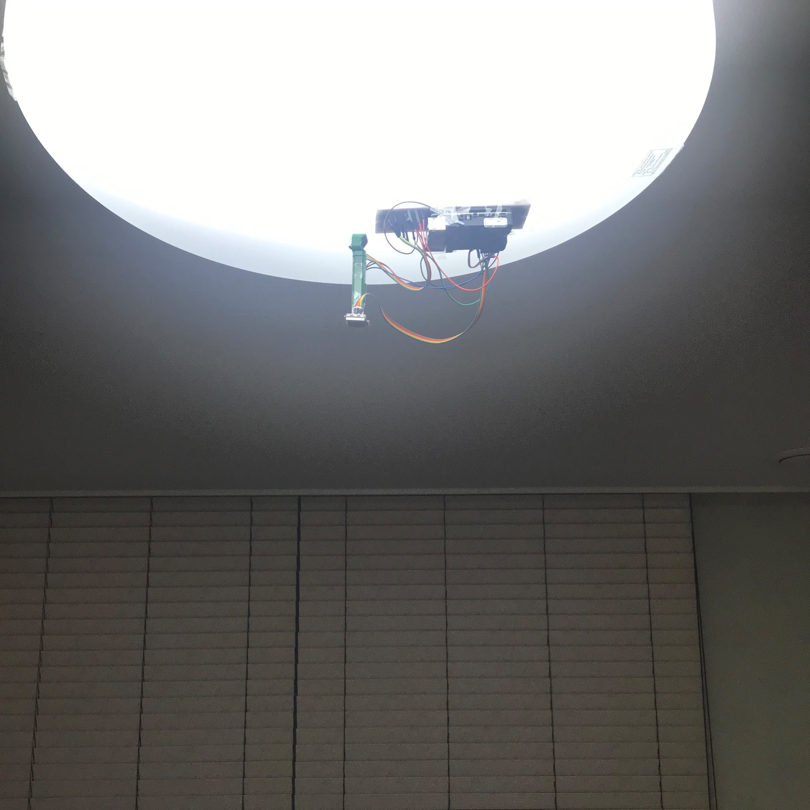
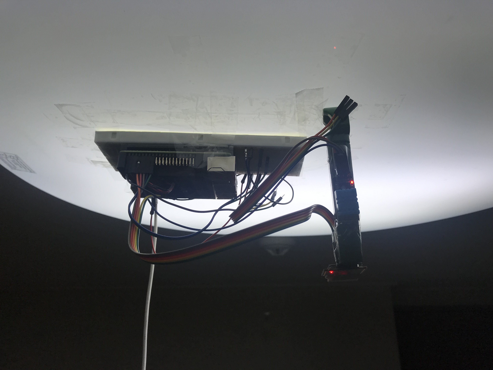
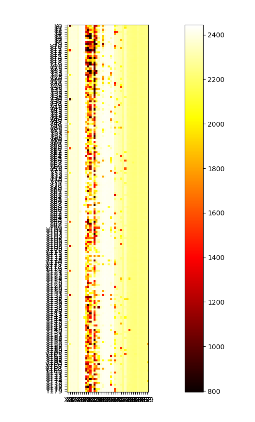
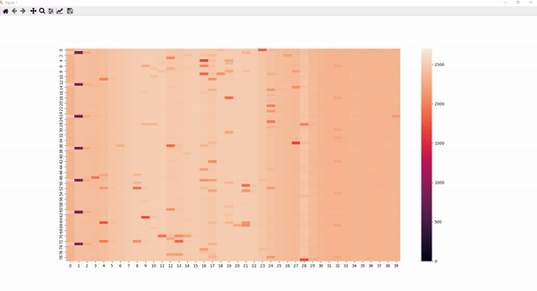
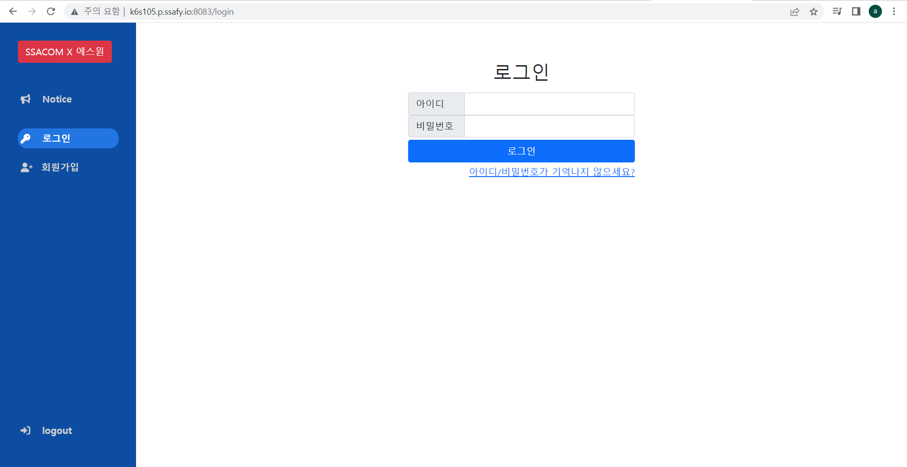
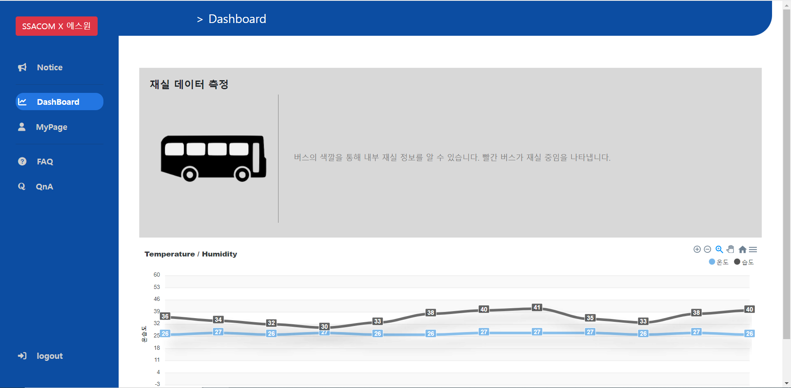
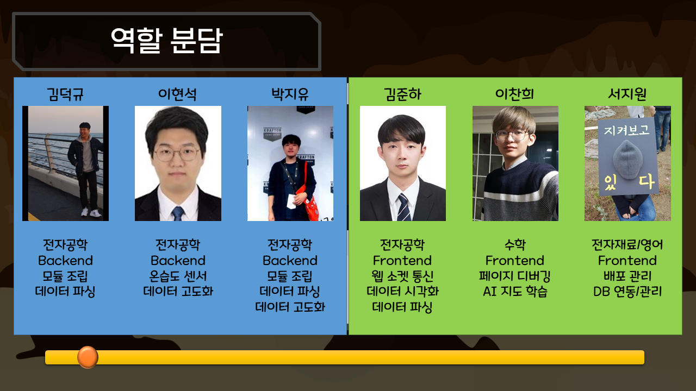

# 기업연계 S105팀 싸콤(SSACOM)

- 사이트 : [싸콤 사이트 접속](http://k6s105.p.ssafy.io:8083/)


- 관련 정보 : [싸콤 노션 / ERD / 목업 / 기능 명세서 / API 설계](https://ninth-tax-ce2.notion.site/c000cf794ec14a3e875947da995ed7ce)

관련된 모든 자세한 사항은 notion에 정리되어 있다.


## 1. 서비스 소개

 싸콤(ssacom) 팀은 삼성에스원과 기업연계를 하여, 기업측에서 제공한 UWB 모듈을 이용해 재실데이터를 받고, 받아온 재실 데이터를 구축한 웹 서버로 전송하여 클라우드 DB에 저장한다. 또한 웹사이트를 구현하여 해당 데이터의 활용 예시를보여주기 위한 대시보드를 제작하였다.

 본 서비스는 재실 모듈이 장착된 IoT 장비가 필요한 서비스이다.


## 2. 버전 정리

```bash
asgiref==3.5.0
certifi==2021.10.8
charset-normalizer==2.0.12
django-cors-headers==3.11.0
djangorestframework-jwt==1.11.0
idna==3.3
PyJWT==1.7.1
requests==2.27.1
cycler==0.11.0
Cython==0.29.28
Django==3.2.13
django-extensions==3.1.5
djangorestframework==3.13.1
fonttools==4.32.0
kiwisolver==1.4.2
matplotlib==3.5.1
mysqlclient==2.1.0
numpy==1.21.6
packaging==21.3
Pillow==9.1.0
pyparsing==3.0.8
python-dateutil==2.8.2
pytz==2022.1
six==1.16.0
sqlparse==0.4.2
tzdata==2022.1
urllib3==1.26.9
channels==3.0.4
channels-redis==3.4.0
tensorflow==2.9.0
```

- channels와 channels-redis 버전 충돌에 주의한다. 이보다 낮은 버전에서 사용하는 경우, 프로그램이 원활히 작동하지 않는다.


## 3. API 설계

[API 설계](https://www.notion.so/7136f146e4a34c0dbe6b9d2deccb8ae9)


## 4. 배포 방법

문서 내용이 길기 때문에 다른 md 파일로 만들어 링크를 걸어두었다. records 폴더에서 확인할 수 있다.

[배포 과정 전반](../전체 배포 과정 정리.md)

```
※백엔드 배포시, 웹소켓을 위해 지정해놓은 폴더 경로가 달라질 수 있으므로 도커를 사용하지 않아야 한다.
나머지(MySQL, 프론트 엔드, nginx, redis)는 도커를 활용해도 무방하다.
```


## 5. IoT 장비 제작

```bash
데이터를 수집하기 위해서는 모듈을 바닥에서 약 2m 떨어진 곳에, 사방을 비우고 설치하는 것이 기본이다.
```

#### (1) 사용한 장치 정보

라즈베리파이4 키트(Breadboard 포함)

UWB 재실 모듈

UART 통신 케이블 (필수는 아님)

온습도 센서 (필수는 아님)


#### (2) 제작 과정

1. 라즈베리파이 4와 온습도 센서 연결



- 라즈베라파이 기판에 온습도 센서를 연결한 모습이다. 검은색 판이 라즈베리파이4 기판이며, 선으로 연결된 파란색 센서가 온습도 센서이다. 모듈이 도착하기 전, 온습도 센서를 먼저 연결하여 데이터를 받고 웹소켓 통신을 테스트하였다.


2. UWB 재실 모듈 연결

 

- UWB 모듈을 연결하기 전, 먼저 빵판(Breadboard)에 연결해서 모듈의 통신을 확인하였다.


- 불이 잘 들어오고, 데이터가 받아지는 것을 확인하였다.




- 온습도 모듈이 설치된 라즈베리파이4에 모듈을 연결한 모습이다.


3. 장비 세팅






- 위의 사진과 같이 바닥에서 약 2m 위, 방의 가운데 모듈을 설치하였다.


## 6. 데이터 시각화

1. 정적 시각화



- 받아온 데이터를 세로로 길게 시각화한 이미지이다. 기업측에서 보내준 예시 데이터 시각화와 흡사한 형태이다.


2. 실시각 시각화



- 데이터 시각화에는 matplot이라는 라이브러리를 활용하였으며, 위의 gif 파일의 경우 사람이 존재하지 않을 때의 재실 데이터를 실시간으로 시각화한 것이다. 진한 색이 거의 드러나지 않으며, 비교적 깔끔하게 데이터를 잘 받아오고 있는 모습을 보여준다.


## 7. 대시보드 서비스 (시연)

```
본 서비스는 모듈 없이는 사용하기 어려우므로, 시연 과정을 따라 순서대로 나열해보았다.
만약 아래의 과정에서 사진이 보이지 않을 경우, exec>assets 안에서 원본 사진을 확인할 수 있다.
```

#### 메인페이지


- 메인 화면은 공백에 네비게이션 바가 있다.


#### 회원가입 페이지


- 좌측 네비게이션바에 있는 회원가입을 클릭하면 회원가입을 할 수 있다. 절차에 따라 가입한다.


#### 로그인 페이지



- 가입한 계정으로 로그인한다. 로그인을 하면 'MyPage'로 넘어가게 된다.


#### 마이페이지


- 로그인 후 가장 먼저 보이는 화면이다. 이제 대시보드를 보기 위해서는 업장 리스트에 있는 자신의 사업장을 클릭하거나, 대시보드를 클릭한다. 만일 여러 사업장이 있는 경우, 좌측 대시보드 버튼을 클릭할 경우 지정해놓은 가장 메인이 되는 사업장의 대시보드로 이동하게 된다. 우리는 한솔 유치원의 대시보드로 접근해보자.


#### 대시보드 1



- 대시보드는 다음과 같이 재실 데이터와 온습도 데이터를 확인할 수 있다. 센서를 추가하는 경우, 다른 정보들도 볼 수 있다. 그러나 일단 UWB 재실 모듈과 온습도 센서를 설치해서 데이터를 받아오는 중이다. 지금 보는 대시보드의 경우 '한솔 유치원'의 대시보드이며, 이들은 버스 안에 모듈을 설치해서 사용하고 있다고 가정해둔 상황이다. 만약 모듈이 사람을 감지한 경우 버스의 색이 붉게 변하게 된다.


#### 대시보드 2 (온습도)


- 모듈이 설치된 장소의 온도/습도 데이터를 한 시간 간격으로 띄워준다. 데이터는 한 시간 간격으로 받아오거나, 온도와 습도가 변화하면 받아오는 형식으로 되어있다. 위의 그래프를 보면 실내 온도가 비교적 일정하게 유지되고 있음을 알 수 있다.


## 7. 팀원 소개



- 서지원(팀장) :  Frontend / AWS 서버에 Docker를 이용해 배포 진행, DB 연동 및 관리, 사용된 알고리즘 확인, 프로젝트 관리
- 김덕규 : Backend / UWB 모듈 조립, 데이터 파싱
- 김준하 : Frontend / 프로토콜 확인 및 데이터 파싱, 웹소켓 통신, 데이터 시각화, CSS 최종 정리
- 박지유 : Backend / 도커를 이용하지 않은 배포, UWB 모듈 조립 및 데이터 수집, 데이터 파싱 및 정제
- 이찬희 : Frontend / 케라스를 이용한 AI 지도학습 코드 구현, 구현된 프론트엔드 테스트(디버깅)
- 이현석 : Backend /  온습도 센서 관련 전반, 데이터 고도화(min pooling 코드 구현)