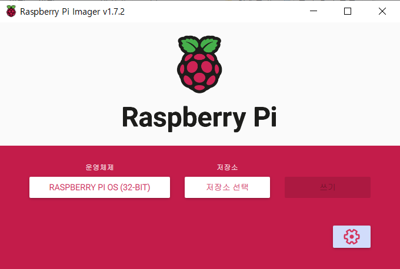
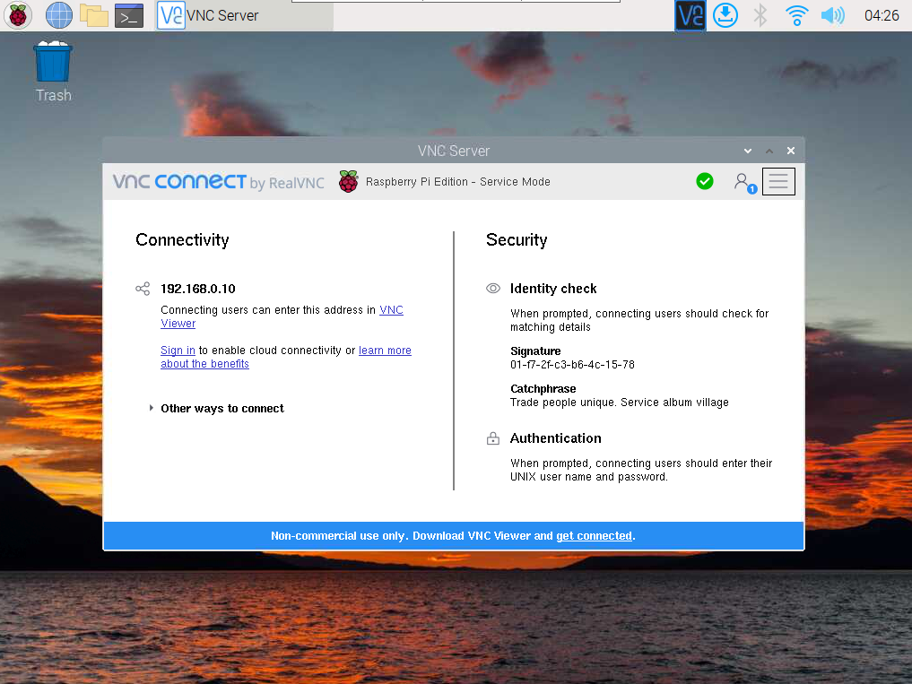
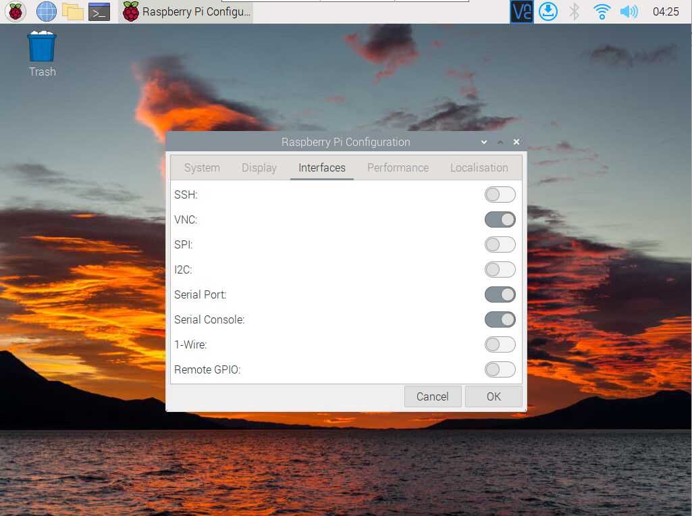
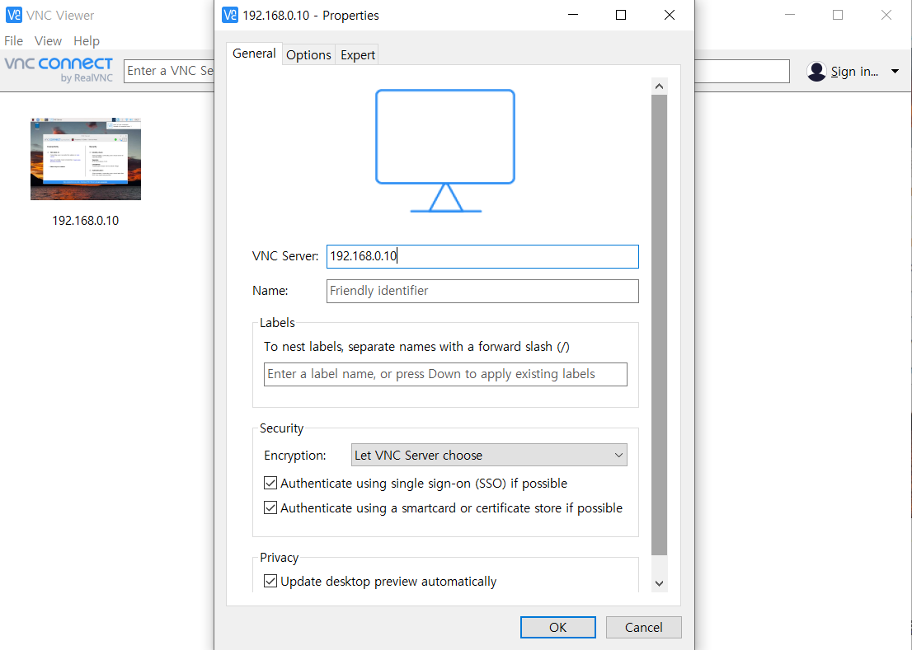
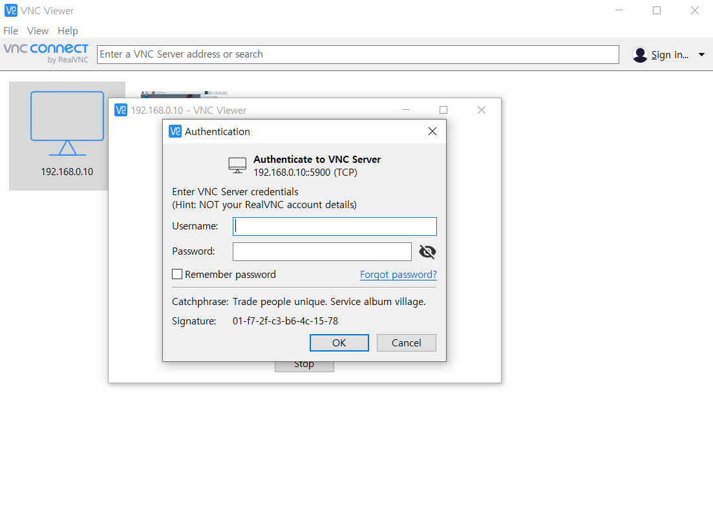
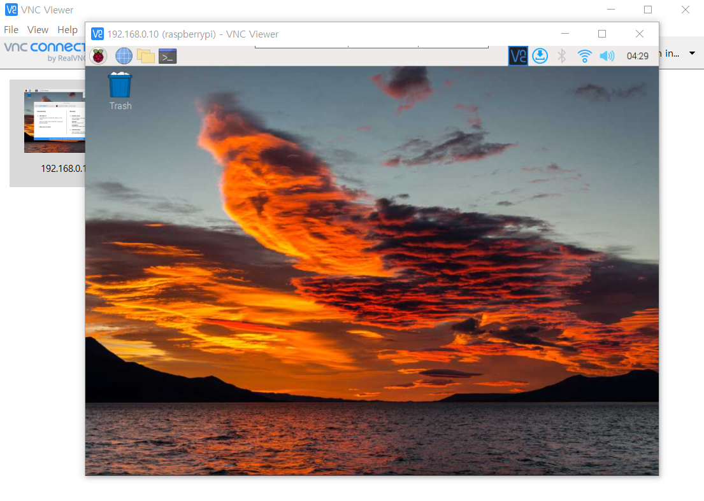
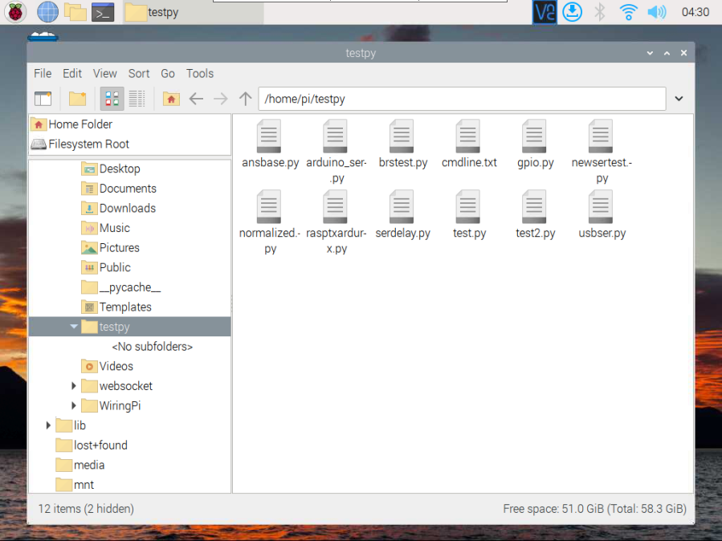
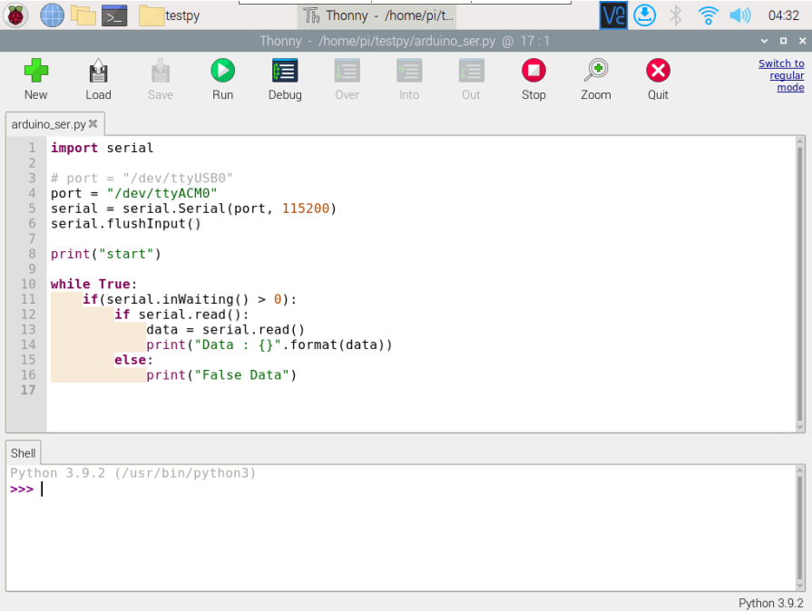
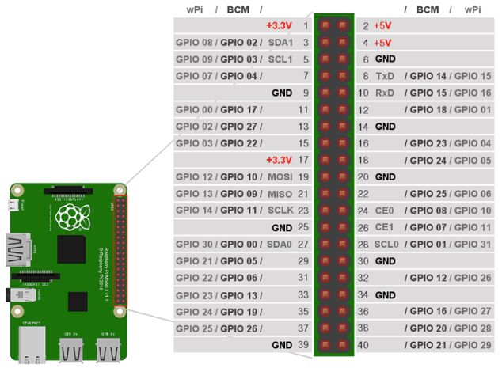

# 라즈베리파이 사용 가이드

#### 1. OS 설치

- 라즈베리파이 공식 홈페이지에서 imager 다운 (https://www.raspberrypi.com/software/)
- 운영체제 선택 후 저장소(sd카드)에 쓰기



#### 2. 컴퓨터 원격조종 환경 구축 (VNC Viewer)

- 라즈베리파이의 IP 찾기 (WIFI 공유기에서도 확인 가능)

  

- 라즈베리파이의 VNC 설정을 ON 해주기

  

- PC에 VNC Viewer 설치 후 연결



- Username과 Password는 default 값으로 pi, raspberry



- 다음 사진과 같이 PC에서도 라즈베리파이 화면 확인 및 조종 가능



#### 3. 라즈베리파이에서 프로그램 동작 (Python)

- 사진과 같이 File manager에서 py 파일 생성



- 생성한 파일은 vi, nano와 같은 터미널 명령어 또는 라즈베리파이 프로그램으로 수정 가능
  (사진의 예시는 Thonny)



#### 4. 라즈베리파이의 GPIO 핀 사용

- 총 40개의 핀에 연결하여 전압, 접지, 디지털 신호, 시리얼 신호 등의 서비스를 제공함
- 핀 연결은 다음 사진을 참고하여 연결
- GPIO 핀을 사용하기 위해 별도의 라이브러리 설치 필요 
  (참고 사이트 : https://m.blog.naver.com/searphiel9/221232071978)



#### 5. serial 통신

- 라즈베리파이와 serial 통신을 위해 pyserial 사용

- 모듈 또는 아두이노 등과 같은 장치와의 통신에 필요 (GPIO핀 또는 USB 연결 등으로 가능)

  (참고 사이트 : https://fishpoint.tistory.com/5311)


#### 6. 웹소켓 통신

- 라즈베리파이에서 python을 사용해 웹소켓 통신
- 라즈베리파이는 client, Django가 server

- asyncio와 websockets 라이브러리 사용

- 라즈베리파이 측 예시 코드

```python
import asyncio
import websockets

async def connect():
	async with websockets.connect("ws://k6s105.p.ssafy.io:30002") as websocket:
		for i in range(1, 10, 1):
			await websocket.send("hello socket!!");
			data = await websocket.recv();
			print(data);
			
asyncio.get_event_loop().run_until_complete(connect())
```

