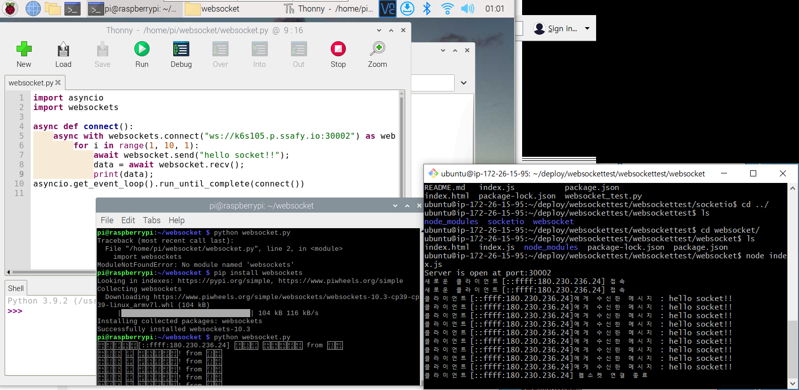
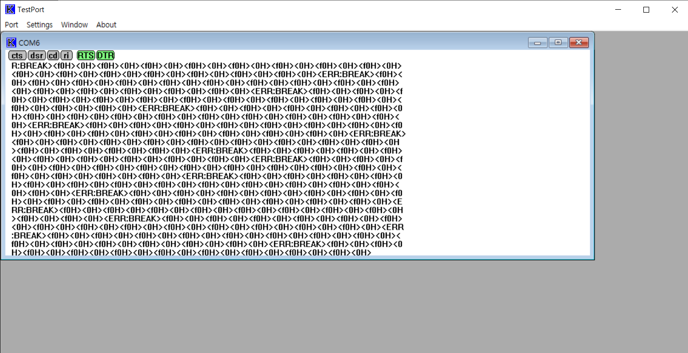
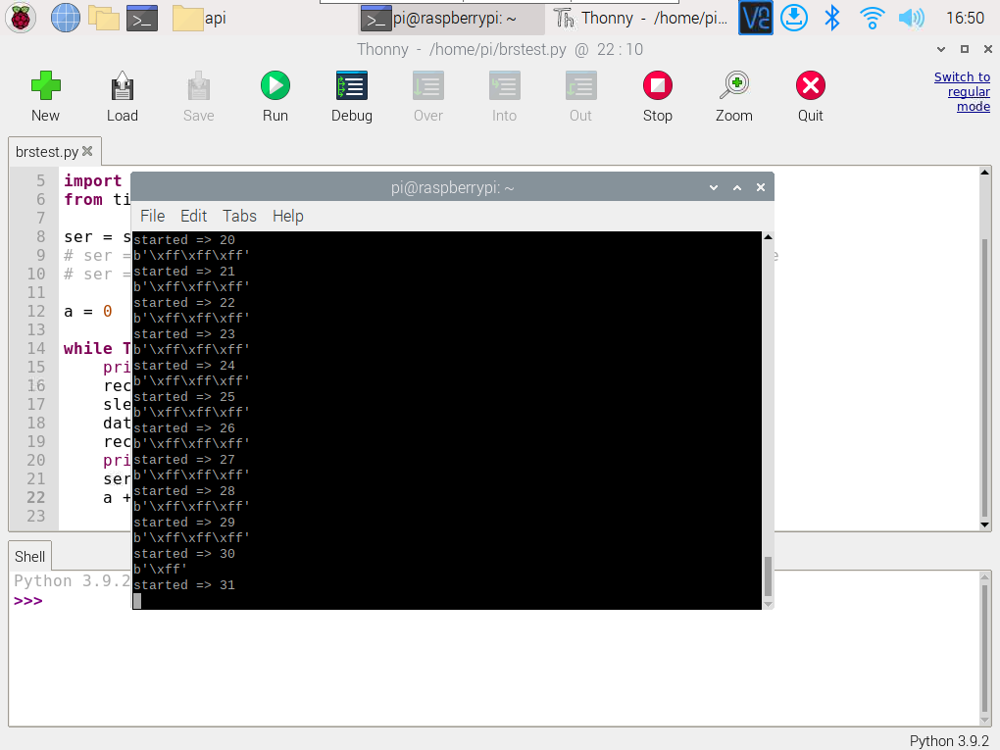

### 라즈베리파이 웹소켓 통신

```python
import asyncio
import websockets

async def connect():
	async with websockets.connect("ws://k6s105.p.ssafy.io:30002") as websocket:
		for i in range(1, 10, 1):
			await websocket.send("hello socket!!");
			data = await websocket.recv();
			print(data);
			
asyncio.get_event_loop().run_until_complete(connect())
```

##### 라즈베리파이와 nodejs 웹소켓 통신 화면 (좌측 : 라즈베리파이(client), 우측 : nodejs(server))



### 스위치 동작에 따른 WebSocket 통신

```python
import asyncio
import websockets
import RPi.GPIO as GPIO
import time

sw=4
led=23
GPIO.setmode(GPIO.BCM)
GPIO.setup(sw,GPIO.IN,GPIO.PUD_DOWN)
GPIO.setup(led,GPIO.OUT)

async def connect():
    async with websockets.connect("ws://k6s105.p.ssafy.io:30002") as websocket:
        try:
            while 1:
                if GPIO.input(sw)==1:
                    GPIO.output(led,GPIO.HIGH)
                    await websocket.send("LED ON!!");
                    print("LED ON!!");
                else :
                    GPIO.output(led,GPIO.LOW)
                    await websocket.send("LED OFF!!");
                    print("LED OFF!!");
                time.sleep(1)
        except KeyboardInterrupt:
            GPIO.cleanup()

asyncio.get_event_loop().run_until_complete(connect())
```

.gif)

### API GET, POST 요청 (동작 확인 완료)

```python
import requests
import json 

# GET 
# res = requests.get('http://k6s105.p.ssafy.io:8000/qna/') 
# print(str(res.status_code) + " | " + res.text) 

# POST (JSON) 
headers = {'Content-Type': 'application/json; chearset=utf-8'}
data = {
    "title": "test_title",
    "content": "test_content",
    "category": "test_category"
}
res = requests.post('http://k6s105.p.ssafy.io:8000/qna/', data=json.dumps(data), headers=headers) 
print(str(res.status_code) + " | " + res.text)
```


# 모듈 Serial 통신 데이터

### UART to USB 모듈 사용 (컴퓨터 연결)





### 라즈베리파이와의 연결

```python
# sudo pip install pyserial
# pyserial 설치 이후 실행 가능
# sudo python3 brstest.py (serial 통신이라 sudo 권한 필요)
# tx는 14, rx는 15번 gpio 사용

import serial
from time import sleep

ser = serial.Serial ("/dev/ttyS0", 115200)

a = 0

while True:
	print("started => {} ".format(a))
	received_data =ser.read()
	sleep(0.03)
	data_left = ser.inWaiting()
	received_data += ser.read(data_left)
	print (received_data)
	ser.write(received_data)
	a += 1
```



### 라즈베리파이 UWB 모듈 입력 PACKET 추가

```python
import serial
from time import sleep
import RPi.GPIO as GPIO

# ser = serial.Serial('/dev/ttyUSB0',115200)
ser = serial.Serial ("/dev/ttyS0", 115200)    #Open port with baud rate
# ser = serial.Serial ("/dev/ttyS0", 921600)    #Open port with baud rate

sw=18

a = 0

packet = bytearray()

packet.append(0x53)#STX1:S
packet.append(0xf1)#STX2
packet.append(0x09)#len
packet.append(0x00)#len
packet.append(0x06)#data
packet.append(0x53)#S
packet.append(0x45)#E
packet.append(0x4e)#N
packet.append(0x44)#D
packet.append(0x5f)#_
packet.append(0x5f)#_
packet.append(0x4f)#O
packet.append(0x4e)#N
packet.append(0x8B)#CHECKSUM
packet.append(0x45)#ETX:E

data_lst = list()

GPIO.setmode(GPIO.BCM)
 
# resistance => pull down
GPIO.setup(sw,GPIO.IN,GPIO.PUD_DOWN)

status = 0

while True:
    ser.write(packet)
    # ser.write(b'xff')
    print ("started => {} ".format(a))
    received_data = ser.read()              #read serial port
    # sleep(0.03)
    data_left = ser.inWaiting()             #check for remaining byte
    received_data += ser.read(data_left)
    data_lst.append(received_data)
    if len(data_lst) == 40:
        print(data_lst)
        data_lst = list()
    print (received_data)                   #print received data
    # ser.write(received_data)
    # ser.write(1)
    a += 1
    
    if GPIO.input(sw)==1 and status == 0:
        print("CHECKED")
        status = 1
        
    elif GPIO.input(sw)==0 and status == 1:
        print("UNCHECKED")
        status = 0
```

